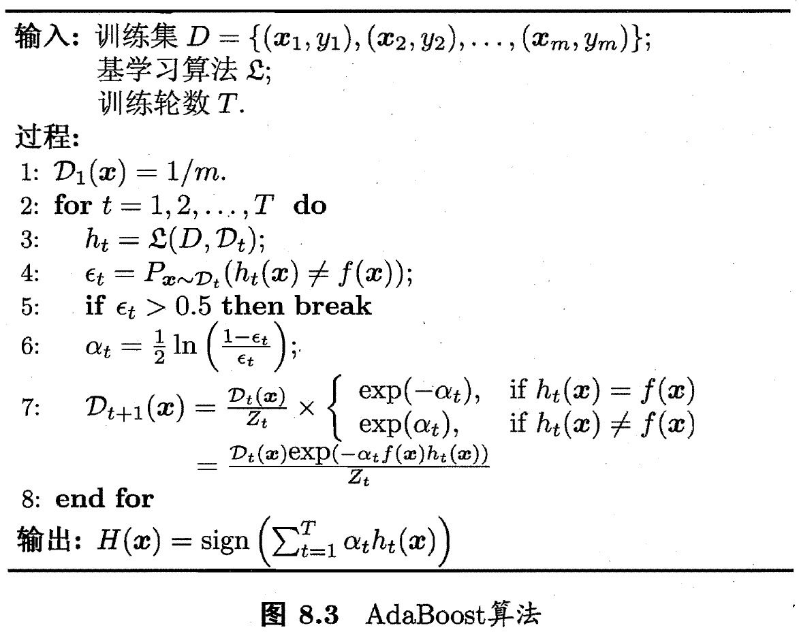
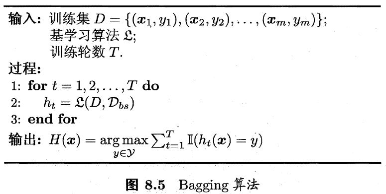
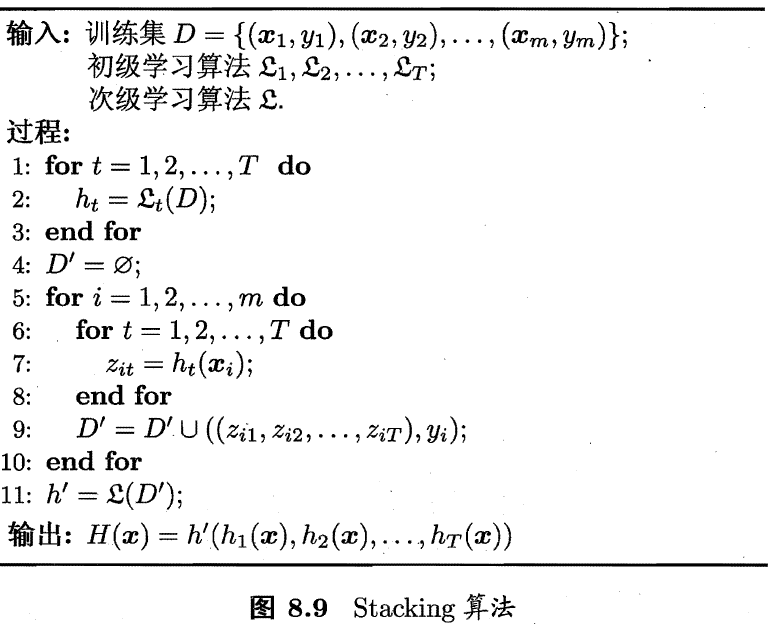

# task1 随机森林算法梳理

任务：

> 1. 集成学习的概念
> 2. 个体学习器的概念
> 3. boosting bagging的概念、异同点
> 4. 理解不同的结合策略(平均法，投票法，学习法)
> 5. 随机森林的思想
> 6. 随机森林的推广
> 7. 随机森林的优缺点
> 8. 随机森林在sklearn中的参数解释
> 9. 随机森林的应用场景
>
> 参考：
>
> - 西瓜书
> - cs229吴恩达机器学习课程
> - 李航统计学习
> - 谷歌搜索
> - 公式推导参考：http://t.cn/EJ4F9Q0

## 1. 集成学习的概念

**先产生一组“个体学习器”，再用某种策略将它们结合起来。**个体学习器通常由一个现有的学习算法从训练数据产生，例如C4.5决策树算法、BP神经网络算法等。

集成学习分为**同质集成**和**异质集成**。同质集成中的个体学习器也叫基学习器，相应的学习算法称为基学习算法。异质集成可以包含不同类型的个体学习器，例如同时包含决策树和神经网络。异质集成中的个体学习器由不同的学习算法生成，个体学习器称为“组件学习器”或直接称为个体学习器。

集成学习通过将多个学习器进行结合，常可获得比单一学习器显著优越的泛化性能，这对弱学习器尤为明显，因此集成学习的很多理论研究都是针对弱学习器进行的，而基学习器有时也被直接称为弱学习器。然而在实际应用中，如果学习器数目较少，人们通常还是选择较强的学习器。

集成学习对个体学习器的要求：个体学习器应好而不同，即个体学习器要有一定的准确性，并且要有多样性。但在现实任务中，个体学习器是为解决同一个问题训练出来的，它们显然不可能相互独立。**事实上，个体学习器的准确性和多样性本身就存在冲突，如何产生并结合“好而不同”的个体学习器，是集成学习研究的核心。**

目前的集成学习方法大致分为两大类：

* 个体学习器间存在强依赖关系、必须串行生成的**序列化方法。如Boosting。**
* 个体学习器间不存在强依赖关系、可同时生成的**并行化方法。如Bagging和随机森林。**

## 2. 个体学习器的概念

见上条。

## 3. boosting bagging的概念、异同点

### Boosting

Boosting是一族可将弱学习器提升为强学习器的算法。工作机制：先从初始训练集训练出一个基学习器，再根据基学习器的表现对训练样本分布进行调整，使得先前基学习器做错的训练样本在后续收到更多关注，然后基于调整后的样本分布来训练下一个基学习器；如此重复进行，直至基学习器数目达到事先指定的值T，最终将这T个基学习器进行加权结合。

Boosting族算法最著名的代表是AdaBoost，如下图所示。



（由于时间关系，暂时没有详细看AdaBoost的公式推导）

### Bagging

Bagging是并行式集成学习方法最著名的代表。它基于自助采样法。给定包含m个样本的数据集，我们使用自助采样法采样出T个含m个训练样本的采样集，然后基于每个采样集训练处一个基学习器，再将这些基学习器进行结合。在对预测输出进行结合时，Bagging通常对分类任务使用简单投票法，对回归任务使用简单平均法。其算法描述如下图所示。



### Boosting和Bagging的异同点

#### 不同点：

* 从偏差-方差分解的角度看
  * Boosting主要关注降低偏差，因此Boosting能基于泛化性能相当弱的学习器构建出很强的集成。
  * Bagging主要关注降低方差，因此它在不剪枝决策树、神经网络等易受样本扰动的学习器上效用更为明显。

* 样本选择：
  * Bagging：训练集是在原始集中有放回选取的，从原始集中选出的各轮训练集之间是独立的。
  * Boosting：每一轮的训练集不变，只是训练集中每个样例在分类器中的权重发生变化。而权值是根据上一轮的分类结果进行调整。
* 样例权重：
  * Bagging：使用均匀取样，每个样例的权重相等
  * Boosting：根据错误率不断调整样例的权值，错误率越大则权重越大。
* 预测函数：
  * Bagging：所有预测函数的权重相等。
  * Boosting：每个弱分类器都有相应的权重，对于分类误差小的分类器会有更大的权重。
* 并行计算：
  * Bagging：各个预测函数可以并行生成
  * Boosting：各个预测函数只能顺序生成，因为后一个模型参数需要前一轮模型的结果。

#### 相同点：

Bagging和Boosting都是将已有的分类或回归算法通过一定方式组合起来，形成一个性能更加强大的分类器，更准确的说这是一种分类算法的组装方法。即将弱分类器组装成强分类器的方法。


## 4. 理解不同的结合策略(平均法，投票法，学习法)

### 平均法

对数值型输出$h_{i}(\boldsymbol{x}) \in \mathbb{R}$，最常见的结合策略是使用平均法。

* 简单平均法

$$
H(\boldsymbol{x})=\frac{1}{T} \sum_{i=1}^{T} h_{i}(\boldsymbol{x})
$$

* 加权平均法

$$
H(\boldsymbol{x})=\sum_{i=1}^{T} w_{i} h_{i}(\boldsymbol{x})
$$

其中$w_i$是个体学习器$h_i$的权重，通常要求$w_i\geq 0$，$\sum_{i=1}^{T} w_i=1$。

加权平均法可认为是集成学习研究的基本出发点，对给定的基学习器，不同的集成学习方法可视为通过不同的方式来确定加权平均法中的基学习器权重。

在实际应用中，加权平均法未必一定优于简单平均法。一般而言，在个体学习器相差较大时宜使用加权平均法，而在个体学习器性能相近时宜使用简单平均法。

### 投票法

对分类任务来说，学习器$h_i$将从类别标记集合$\{c_1, c_2, ..., c_N\}$中预测出一个标记，最常见的结合策略是使用投票法。将$h_i$在样本$\boldsymbol{x}$上的预测输出表示为一个N维向量$(h_i^1(\boldsymbol{x}); h_i^2(\boldsymbol{x}); ...; h_i^N(\boldsymbol{x}))$，其中$h_i^j(\boldsymbol{x})$是$h_i$在类别标记$c_j$上的输出。

* 绝对多数投票法

$$
H(\boldsymbol{x})=\left\{\begin{array}{ll}{c_{j},} & {\text { if } \sum_{i=1}^{T} h_{i}^{j}(\boldsymbol{x})>0.5 \sum_{k=1}^{N} \sum_{i=1}^{T} h_{i}^{k}(\boldsymbol{x})} \\ {\text { reject, }} & {\text { otherwise. }}\end{array}\right.
$$

即若某标记得票数过半数，则预测为该标记，否则拒绝预测。

* 相对多数投票法

$$
H(\boldsymbol{x})=c_{\arg \max _{j} \sum_{i=1}^{T} h_{i}^{j}(\boldsymbol{x})}
$$

即预测为得票最多的标记，若同时有多个标记获最高票，则从中随机选取一个。

* 加权投票法

$$
H(\boldsymbol{x})=c_{\arg \max _{j} \sum_{i=1}^{T} w_ih_{i}^{j}(\boldsymbol{x})}
$$

### 学习法

当训练数据很多时，一种更为强大的结合策略是使用“学习法”，即通过另一个学习器来进行结合。Stacking是学习法的典型代表。这里我们把个体学习器称为初级学习器，用于结合的学习器称为次级学习器或元学习器。

Stacking先从初始训练集训练出初级学习器，然后生成一个新数据集用来训练次级学习器。在这个新数据集中，**初级学习器的输出被当做样例输入特征**，而初始样本的标记仍被当做样例标记。Stacking的算法描述如下图所示，这里假定初级学习器使用不同学习算法生成，即初级集成是异质的。



## 5. 随机森林的思想

随机森林（Random Forest，简称RF）是Bagging的一个扩展变体。RF在以决策树为基学习器构建Bagging集成的基础上，进一步在决策树的训练过程中引入了随机属性选择。具体来说，传统决策树在选择划分属性时是在当前结点的属性集合（假定有$d$个属性）中选择一个最优属性；而在RF中，对基决策树的每个结点，先从该结点的属性集合中随机选择一个包含$k$个属性的子集，然后再从这个子集中选择一个最优属性用于划分。这里的参数$k$控制了随机性的引入程度：若令$k=d$，则基决策树的构建与传统决策树相同；若令$k=1$，则是随机选择一个属性用于划分；一般情况下，推荐值$k=\log_2d$。

随机森林**简单、容易实现、计算开销小**，但它在很多现实任务中展现出强大的性能，被誉为“代表集成学习技术水平的方法”。随机森林对Bagging只做了小改动，但与Bagging中基学习器的多样性仅通过样本扰动而来不同，随机森林中基学习器的多样性不仅来自样本扰动，还来自**属性扰动**，这就使得最终集成的泛化性能可通过个体学习器之间差异度的增加而进一步提升。

随机森林的收敛性与Bagging类似。其起始性能往往相对较差，随着个体学习器数目的增加，随机森林通常会收敛到更低的泛华误差。值得一提的是，随机森林的训练效率常优于Bagging，这是因为随机森林使用的决策树在选择划分属性时只需考察一个属性子集。

## 6. 随机森林的推广

由于没有找到相关的资料，参考了简书博主**白尔摩斯**的分享，附在References中。

常见的RF变种算法如下：Extra Tree、Totally Random Tree Embedding(TRTE)、Isolation Forest。

### Extra Tree

Extra Tree是随机森林(RF)的一个变种，原理基本和随机森林一样，区别如下：

* RF会随机采样来作为子决策树的训练集，而Extra Tree每个子决策树采用原始数据集训练。
* RF在选择划分特征点的时候会和传统决策树一样，会基于信息增益、信息增益率、基尼系数、均方差等原则来选择最优的特征值。Extra Tree则是随机选择一个特征值来划分决策树。

由于Extra Tree是随机选择特征点进行划分，所以最后得到的决策树规模会大于RF生成的决策树，Extra Tree决策树的方差会减少，泛化能力比RF更强。

### Totally Random Tree Embedding(TRTE)

**TRTE** 是一种非监督的数据转化方式。将低维的数据集映射到高维，从而让高维的数据更好得用于分类回归模型。

TRTE的算法的转化过程类似于RF算法，建立T个决策树来拟合数据。当决策树构建完成之后，数据集里的每个数据在T个决策树中叶子节点的位置就固定下来了，将位置信息转换为向量即完成了算法的转换。

有3棵决策树，每棵树都有五个叶子节点： □-□-□-□-□

 一个数据 x

 划分落入树1的第三个子节点：□-□-■-□-□ => 00100

 划分落入树2的第一个子节点：■-□-□-□-□ => 10000

 划分落入树3的第五个子节点：□-□-□-□-■ => 00001

 数据x的特征映射码：(0,0,1,0,0, 1,0,0,0,0, 0,0,0,0,1)

样本根据TRTE进行转化特征，最后可能得到更高维的数据，也可能得到更低维的数据，如词袋法中的特征有2000个，做完TRTE后只剩下几百个。

经过TRTE转化后的编码可以用于无监督的分类操作，将相似的特征码聚类到一起，最后完成分类的操作。

### Isolation Forest (IForest)

**IForest**是一种异常点检测算法，使用类似RF的方式来检测异常点。

**IForest和RF的区别在于：**

1. 在随机采样的过程中，一般只需要少量的数据。
2. 在进行决策树的构建过程中，IForest会随机选择一个划分特征，并对划分特征随机选择一个划分阈值。
3. IForest的划分深度是比较小的，即max_depth较小。

区分原因：目的是异常点检测，所以只要能够区分出异常即可，不需要大量的数据；此外在异常点检测过程中，一般也不需要太大规模的决策树。

## 7. 随机森林的优缺点

### 优点：

- 训练可以并行化，对于大规模样本的训练具有速度的优势。
- 由于进行随机选择决策树划分特征列表，这样在样本维度比较高的时候，仍然具有比较高的训练性能。
- 可以给出各个特征值的重要性列表。
- 由于存在随机抽样，训练出来的模型方差小，泛化能力强。
- RF实现简单。
- 对于部分特征的丢失不敏感。

### 缺点：

* 噪音过大的特征上，容易过拟合。
* 取值比较多的划分特征对RF的决策会产生更大的影响，从而有可能影响模型的效果。

## 8. 随机森林在sklearn中的参数解释

随机森林的sklearn分为`RandomForestClassifier`和`RandomForestRegressor`。

```python
RandomForestClassifier(n_estimators=’warn’, criterion=’gini’, max_depth=None, min_samples_split=2, min_samples_leaf=1, min_weight_fraction_leaf=0.0, max_features=’auto’, max_leaf_nodes=None, min_impurity_decrease=0.0, min_impurity_split=None, bootstrap=True, oob_score=False, n_jobs=None, random_state=None, verbose=0, warm_start=False, class_weight=None)
RandomForestRegressor(n_estimators=’warn’, criterion=’mse’, max_depth=None, min_samples_split=2, min_samples_leaf=1, min_weight_fraction_leaf=0.0, max_features=’auto’, max_leaf_nodes=None, min_impurity_decrease=0.0, min_impurity_split=None, bootstrap=True, oob_score=False, n_jobs=None, random_state=None, verbose=0, warm_start=False)
```

二者参数基本相同，下面以`RandomForestClassifier`为例进行说明。

| 参数                     | 解释                                                         |
| ------------------------ | ------------------------------------------------------------ |
| n_estimators             | 森林中树的个数。                                             |
| criterion                | 选择划分属性的依据，默认为基尼指数。                         |
| max_depth                | 树的最大深度。                                               |
| min_samples_split        | 分割节点要求的最小样本数目。                                 |
| min_samples_leaf         | 叶节点要求的最小样本数目。                                   |
| min_weight_fraction_leaf | 叶节点要求的最小样本权重和。                                 |
| max_features             | 寻找最优化分时考虑的特征数目。                               |
| max_leaf_nodes           | 叶节点数目的最大值。                                         |
| min_impurity_decrease    | 纯度下降的最小值，如果纯度下降小于这个值，会重新划分。       |
| min_impurity_split       | 纯度下降的限度，如果某个节点的全部划分都小于这个值，那么停止划分。 |
| bootstrap                | 是否进行自助采样                                             |
| oob_score                | 是否用oob（袋外误差）来衡量误差                              |
| n_jobs                   | 并行的数量                                                   |
| random_state             | 随机种子                                                     |
| verbose                  | 输出信息的详细程度                                           |
| warm_start               | 设置为true时，重用之前调用的模型来添加更多的学习器；否则构建新的森林 |
| class_weight             | 类别权重                                                     |

## 9. 随机森林的应用场景

分类、回归、特征转换、异常点检测等。

PS：如果不知道用什么模型合适，可以先试试随机森林。

## References

* 西瓜书
* Boosting和Bagging的不同点：https://www.cnblogs.com/liuwu265/p/4690486.html
* 随机森林的变种和优缺点：https://www.jianshu.com/p/311024d128ad
* sklearn接口：https://scikit-learn.org/stable/modules/generated/sklearn.ensemble.RandomForestClassifier.html


